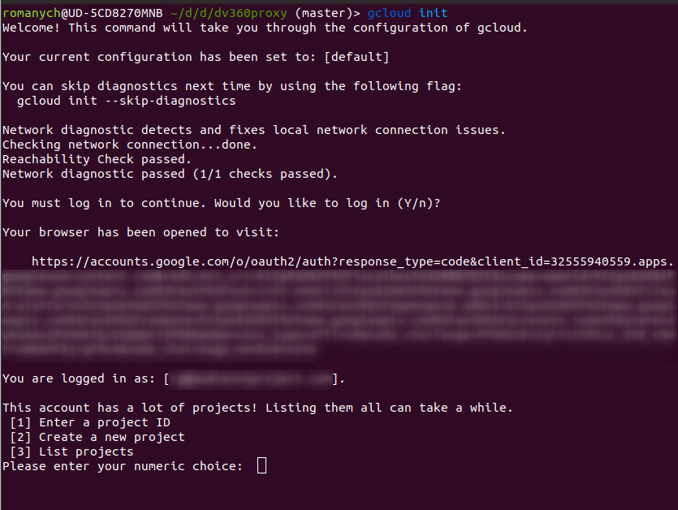

# DV360 Proxy for Google Compute Cloud

Table of Contents
=================

   * [DV360 Proxy for Google Compute Cloud](#dv360-proxy-for-google-compute-cloud)
   * [API Reference](#api-reference)
   * [Configuration](#configuration)
   * [Deployment](#deployment)
      * [Step 1 - init new application](#step-1---init-new-application)
      * [Step 2 - enable required services](#step-2---enable-required-services)
      * [Step 3 - link the project to a billing account](#step-3---link-the-project-to-a-billing-account)
      * [Step 4 - deploy function](#step-4---deploy-function)
      * [Step 5 - allow AudienceProject to call the function](#step-5---allow-audienceproject-to-call-the-function)
      * [Step 6 - give project access to DV360 partner/advertiser](#step-6---give-project-access-to-dv360-partneradvertiser)
      * [Step 7 - test if everything works](#step-7---test-if-everything-works)
      * [Updates](#updates)
      * [API Limits](#api-limits)


This solution acts as a proxy to access DV360 reports without giving direct access to DV360 API.
It solves three tasks:
- Whitelists advertisers allowed to access
- Blacklist metrics not allowed to access
- Log of requests made

Except of this is acts as a proxy, with no modification of requests and responses.


# API Reference

Solution exposes Cloud function, that needs to be invoked directly using secure HTTP call. There is built-in possibility to allow only certain Google Account to call the Cloud function.

The Function receives request, validates is against allowed Advertisers and Metrics and invokes corresponding DV360 API. The proxy uses [v1.1 DBM API](https://developers.google.com/bid-manager/v1.1) and exposes query-related methods.

Request object structure is the following:

```
{
  "operation": apiOperation,
  "arguments": operationArguments
  }
}
```

`apiOperation` is one of:
* `getQueries`
* `getQuery`
* `createQuery`
* `runQuery`
* `deleteQuery`
* `getQueryReports`

`operationArguments` are different for different operations

| Operation     | Arguments           |
| ------------- |-------------|
| `getQueries`      | `{ pageToken }` |
| `getQuery`      | `{ queryId }`      |
| `createQuery` | `{ query }` format defined at https://developers.google.com/bid-manager/v1.1/queries#resource      |
| `runQuery` | `{ queryId, data }` format defined at https://developers.google.com/bid-manager/v1.1/queries/runquery#request-body      |
| `deleteQuery` | `{ queryId }` |
| `getQueryReports` | `{ queryId, pageToken }` |

Example:
```json
{
  "operation": "createQuery",
  "arguments": {
    "query": {
      "kind": "doubleclickbidmanager#query",
      "metadata": {
        "title": "Test",
        "dataRange": "CURRENT_DAY",
        "format": "CSV",
        "locale": "en"
      },
      "params": {
        "type": "TYPE_GENERAL",
        "groupBys": [
          "FILTER_ADVERTISER",
          "FILTER_LINE_ITEM"
        ],
        "filters": [{
          "type": "FILTER_ADVERTISER",
          "value": "1"
        }],
        "metrics": [
          "METRIC_IMPRESSIONS"
        ]
      },
      "schedule": {
        "frequency": "ONE_TIME"
      },
      "timezoneCode": "UTC"
    }
  }

}
```


# Configuration

The Function needs to be configured to allow only whitelisted partner and advertisers to be queried and blacklisted fields. Such configuration is done using JSON format that has format below

```json
{
  "partners": [
    {
      "id": "1234",
      "advertisers": [
        {
          "id": "456",
          "blacklistMetrics": [
            "_COST_",
            "_FEE_"
          ]
        },
        {
          "id": "789"
        }
      ]
    },
    {
      "id": "2345",
      "advertisers": [
        {
          "id": "987",
          "blacklistMetrics": [
            "_COST_",
            "_FEE_",
            "_VIDEO_"
          ]
        }
      ]
    }
  ]
}
```

It can be human-read as following:
* Advertiser 456 belonging to partner ID 1234 can be queried, except Cost and Fee data
* Advertiser 789 belonging to partner ID 1234 can be queried without limits
* Advertiser 987 belonging to partner ID 2345 can be queried, except Cost, Fee and Video metrics (e.g. `METRIC_RICH_MEDIA_VIDEO_COMPLETIONS`)

> Notes:
> * Metrics validated against blacklist using `indeOf()`
> One query may request multiple partners, advertisers. If any of the checks got failed - entire request will be refused.

In order to help with JSON file creation, you can find `configurator.html` in the repo that provides UI for file generation. You need to make configuration and download `env.yaml` file and put this into `dv360proxy` folder.


This configuration needs to be passed to the Function using `DV360_PROXY_CONFIG` env variable passed through `env.yaml` file.

# Deployment

Entire deployment happens from CLI, so you need to make sure [gcloud SDK](https://cloud.google.com/sdk/docs/install) is insatalled.

Then you need to set `dv360proxy` as your working directory and all commands from it.

## Step 1 - init new application

You need to create new Google Cloud Application by running
```sh
gcloud init
```

You may be prompted to log in and give SDK necessary permissions - please do this.

Then, you need to choose  "Create a new project"



You will be prompted for project ID, please follow `{agency}-ar-dv360-connector` template, for instance `mybestagency-ar-dv360-connector`.


## Step 2 - enable required services

```sh
gcloud services enable displayvideo.googleapis.com doubleclickbidmanager.googleapis.com  cloudfunctions.googleapis.com cloudbuild.googleapis.com
```

## Step 3 - link the project to a billing account

Open Google Cloud Console and Navigate to Billing section of newly created project and link with existing billing account. There will be only Cloud Function workload, so we talk about sub-$1 / month.


## Step 4 - deploy function

**Make sure you have created configuration file `env.yaml` and copied to the current folder**

**Don't allow anonymous invocation when prompted!**

```sh
gcloud functions deploy dv360request --runtime nodejs10 --trigger-http --env-vars-file env.yaml
```

## Step 5 - allow AudienceProject to call the function

```sh
gcloud functions add-iam-policy-binding dv360request  --member=serviceAccount:invoker@audienceproject-dv360-proxy.iam.gserviceaccount.com --role=roles/cloudfunctions.invoker
```

## Step 6 - give project access to DV360 partner/advertiser

In Google Cloud Console you need to navigate to the **Credentials** screen and copy email of created Service Account. Then add this email to DV360 and give **Readonly** permission to required Advertisers.


## Step 7 - test if everything works

There is special operation that can test API connection and Partner/Advertiser configuration - `ping`.

Just call the function with `{"operation": "ping"}` payload and it will diagnose the setup.

```sh
gcloud functions call dv360request --data '{"operation": "ping"}'
```

**Examples**

Valid configuration:
```json
{
    "ok": true,
    "canAccessDV360Api": true,
    "canAccessDBMApi": true,
    "errors": [],
    "availableAdvertisers": [{
        "advertiserId": "1234566",
        "advertiserName": "Some advertiser",
        "blacklistMetrics": ["_FEE_", "_COST_"],
        "partnerId": "12345"
    }],
    "unavailableAdvertisers": []
}
```

Inaccessible advertiser configured:
```json
{
    "ok": false,
    "canAccessDV360Api": true,
    "canAccessDBMApi": true,
    "errors": ["GET /advertisers/666 responded with 403"],
    "availableAdvertisers": [{
        "advertiserId": "1234566",
        "advertiserName": "Some advertiser",
        "blacklistMetrics": ["_FEE_", "_COST_"],
        "partnerId": "12345"
    }],
    "unavailableAdvertisers": [{
        "advertiserId": "666",
        "partnerId": "12345"
    }]
}
```

Access not configured

```json
{
    "ok": false,
    "canAccessDV360Api": false,
    "canAccessDBMApi": false,
    "errors": ["GET /advertisers/3482931 responded with 403", "Unable to connect to DBM API"],
    "availableAdvertisers": [],
    "unavailableAdvertisers": [{
        "advertiserId": "3482931",
        "partnerId": "2828536"
    }]
}
```

## Updates

If you need to update code base or configuration, you just need to re-deploy the function using the same command as in Step 5.


## API Limits

There is not built-it throttling or rate-limits in the proxy. These limits can be managed in Google Developer Console.

DV360Proxy has embed retry policies on retryable API errors with exponential backoff.


